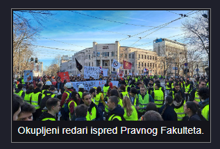
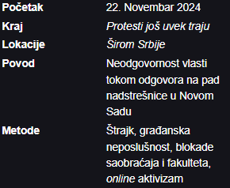
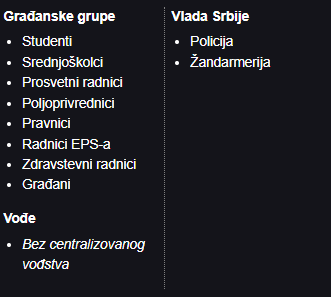

_U ovoj dokumentaciji i bilo kom drugom tehničkom tekstu "članak" se odnosi samo na tekst na jednoj stranici, dok je "stranica" sve uključujući i članak_

## Sadržaj

- [Uređivačke smernice](#uređivačke-smernice)
  - [1. Objektivnost](#1.-objektivnost)
  - [1a. Šta je validan izvor?](#1a.-šta-je-validan-izvor?)
  - [2. Dodavanje slika na stranice](#2.-dodavanje-slika-na-stranice)
  - [3. Vandalizam i zloupotreba](#3.-vandalizam-i-zloupotreba)
  - [4. Stranice o osobama koje nisu javne ličnosti](#4.-stranice-o-osobama-koje-nisu-javne-ličnosti)
- [Funkcionalnost Sajta](#funkcionalnost-sajta)
  - [Osnove](#osnove)
  - [Korisnici i zaštita stranice](#korisnici-i-zaštita-stranice)
  - [Specijalne stranice](#specijalne-stranice)
- [Sintaksna Dokumentacija](#sintaksna-dokumentacija)
  - [Osnove](#osnove)
  - [Naslovi](#naslovi)
  - [Hiperlinkovi i slike](#hiperlinkovi-i-slike)
  - [Referenciranje izvora](#referenciranje-izvora)
  - [Anotacije](#anotacije)
  - [Redirect](#redirect)
  - [Dropdown](#dropdown)
  - [Infobox](#infobox)

## Uređivačke smernice

### 1. Objektivnost

Pri pisanju članaka za wikiju molimo vas da održite objektivnost. Širenjem dezinformacija nismo ništa bolji od ljudi o kojima pišemo. Svaka velika tvrdnja mora biti podržana sa validnim izvorom, u suprotnom može biti obrisana u bilo kom momentu od strane drugih korisnika. Takođe je poželjno da se održava takozvani novinski stil pisanja u kome se informacije sažeto i direktno prenose čitaocu.

### 1a. Šta je validan izvor?

Validan izvor je onaj koji podržava priloženu tvrdnju i pritom je pouzdan.

**Dobri izvori su:** Naučni rad objavljen u poznatom akademskom magazinu, novinski članak napisan i objavljen u pouzdanom listu. Video ili foto materijal koji jasno prikazuje i podržava priloženu tvrdnju.

**Loši izvori su:** Novinski članak bez autora objavljen u listu poznatom po širenju dezinformacija. Informacija na osnovu "...čuo sam negde/od nekog...".

Izvor dodat u članak **mora** da sadrži naslov, platformu na kojoj je objavljen (N1, RTS, Instagram @...) i datum objavljivanja, dok su ostale informacije poželjne ali ne i obavezne. Izvor **mora** biti _up-to-date_.

### 2. Dodavanje slika na stranice

Molimo vas da sačuvate ovaj naš projekat od pravnih problema i dodajete samo slike za koje imate dozvolu za korišćenje. U to spada direktna dozvola autora slike ALI i free-use/CC slike u javnom domenu. Dodavanje slika irelevantnih stranici na koje su dodate spada pod zloupotrebu. Upotreba i dodavanje AI generisanih slika je zabranjena.

### 3. Vandalizam i zloupotreba

Zbog veoma široke mreže botova na srpskom internet prostoru uvedena je politika **NULTE TOLERANCIJE** na vandalizam. Jasan vandalizam biće odmah sankcionisan uklanjanjem sa wikije (banom). Jedine osobe koje mogu da uklone banove su korisnici u rangu sistemskog administratora, i njima možete da uložite žalbu na ban u Discord serveru, mada uklanjanje bana nije garantovano.

Zloupotreba i vandalizam u ovom smislu podrazumeva:

- Namernu izmenu članka tako da sadrži neprikladan, neistinit, neobjektivan sadržaj ili sadržaj drugačije disruptivan tonu wikije.
- Stvaranje stranica nevezanih za temu wikije.
- Dodavanje slika bez dozvole korišćenja ili slika nevezanih za stranicu. Dodavanje AI generisanih slika.
- Bilo kakav pokušaj _server-side_ disrupcije.

Neke stranice mogu biti zaštićene, što znači da samo potvrđeni korisnici mogu da ih uređuju. Korisnike potvrđuju administratori sajta. Više o zaštiti možete pročitati ispod.

### 4. Stranice o osobama koje nisu javne ličnosti

Popularna ideja kada je ovaj sajt prvi put objavljen je bila da se napravi lista batinaša i drugih poltrona vlasti. Molili bi vas da, ukoliko te osobe nisu javne ličnosti ili ne vrše javnu funkciju, zaobiđete pravljenje stranica namenjenih njima. Jasan nam je (opravdan) bes prema ovim osobama, ali objavljivanje tuđeg imena, prezimena i fotografija spada u nelegalno objavljivanje tuđih privatnih informacija tojest _doxxovanje_. Neki mediji u Srbiji to regularno rade, ali ti mediji nekako prolaze ispod radara dok krše ovaj i druge zakone, a naš sajt nema takve privilegije.

Naravno, ove osobe još uvek možete spominjati na tuđim stranicama ukoliko imaju neke veze s temom.

## Funkcionalnost Sajta

### Osnove

SrbijaWiki sajt je sačinjen od stranica. Svaka stranica, pored samog članka, ima svoje:

- Metapodatke, ovi podaci bliže opisuju članak u sažetom formatu. Oni se pojavljuju u Google pretrazi i sličnim mestima.
- Slike, koje se koriste u članku. Iako je moguće direktno koristiti URL do slike u članku, dodavanjem slike na stranicu garantujete da ona neće biti obrisana (osim ako prekršite autorska prava ili ako je slika irelevantna).
- Istoriju, koja prati izmene na jednoj stranici. Svaki _entry_ u istoriji ima datum kada je objavljen, i izmene koje su napravljene. Tip izmena može biti HTML (izmene u članku) ili META (izmene u metapodacima), a META izmene ne možete direktno povratiti, iako se prate.

### Korisnici i zaštita stranice

Svaka stranica može, ali i ne mora, biti zaštićena (ovo je deo metapodataka jedne stranice). Zaštita stranice ima tri nivoa:

- **Osnovna**, gde pravo uređivanja imaju potvrđeni korisnici i svi iznad njih.
- **Napredna**, gde pravo uređivanja imaju administratori i svi iznad njih.
- **Sistemska**, koja se koristi za zaštitu ključnih stranica, gde pravo uređivanja imaju samo sistemski administratori.

Korisnici se dele na pet rangova:

- **Korisnik**, _default_ opcija, nema nikakve specijalne privilegije.
- **Potvrđeni korisnik**, rang za korisnike koji su pokazali savesno uređivanje stranica. Jedina razlika između njih i regularnih korisnika je mogućnost uređivanja stranica pod osnovnom zaštitom, i uklanjanja slika s wikije.
- **Administrator**, rang koji dodeljuju sistemski administratori. Oni mogu da uklanjaju korisnike koje krše pravila uređivanja, i postavljaju zaštitu na stranice.
- **Viši administrator**, rang koji dodeljuju sistemski administratori. Oni mogu da brišu stranice koje krše pravila uređivanja, pomeraju stranice, i dižu korisnike u rang potvrđenih korisnika.
- **Sistemski administrator**, rang koji ima potpunu kontrolu nad wikijom.

### Specijalne stranice

Specijalne stranice su one sa prefiksom `Special:`. One su uvek pod sistemskom zaštitom i imaju neku namenu važnu za funkcionisanje sajta.

Trenutno jedine specijalne stranice su:

- Admin Log, koji prati sve bitne izmene na sajtu poput stvaranja/uklanjanja novih stranica, slika, i akcija nad korisnicima.
- Sandbox, u kom možete pisati članke i videti kako izgledaju bez da ih objavite. **Sandbox se čuva u lokalnoj memoriji vašeg pretraživača, koju možete slučajno obrisati dok brišete istoriju/kolačiće. Budite oprezni.**

## Sintaksna Dokumentacija

Preporučujemo da ovaj deo dokumentacije čitate po potrebi jer može biti dugačak i težak da se razume ako se čita ceo odjednom. Najbitniji deo jednog članka je sam tekst, i za to vam ne treba ništa osim tastature i volje za pisanjem.

### Osnove

Jezik u kom se pišu članci na ovoj wikiji je custom (našminkani) HTML. Ovo naravno znači da tehnički možete pisati sve članke u običnom HTML-u, ali vas molimo da korišćenje čistog HTML-a rezervišete za neke komplikovanije primene koje nisu već integrisane u naš wiki jezik.

Za potpune HTML početnike, ovaj jezik se sastoji od tagova. Većina tagova mora da se zatvori, i efekti tog taga se odnose na tekst unutar njega. Otvarajući i zatvarajući tag predstavljaju jedan element.

Neke osnovne tagove nismo napravili custom, i ne planiramo, jer ne mogu biti dalje pojednostavljeni:

- `<i></i>` čini tekst unutar tagova _italic_.
- `<b></b>` čini tekst unutar tagova **bold**.
- `<ul></ul>` zajedno sa `<li></li>` stvara liste. O ovome možete čitati ovde.

Nema potrebe koristiti `<br>` ili `<p>` jer wikija sama pretvara nove linije u editoru u paragrafe.

### Naslovi

Naslovi se u članak dodaju koristeći tagove `<w-h1></w-h1>`, gde je broj (`1` u ovom slučaju) veličina naslova. Najveći naslovi se označavaju sa 1, srednji sa 2 a najmanji sa 3.

### Hiperlinkovi i slike

Hiperlinkovi se u članak dodaju koristeći tag `<w-a></w-a>`. Potrebno je da prvo unesete tekst koji menja link, pa potom sam URL odvojen ravnom crtom (|). Ukoliko želite da linkujete do druge stranice na SRBWiki samo unesite naslov članka umesto URL-a. Obratite pažnju na to da su naslovi _case-sensitive_.

Tzv. spoljni linkovi, koji vode van SRBWiki, imaju malu ikonicu pored sebe koja označava to, a unutrašnji linkovi koji vode na nepostojeće stranice su obojeni u crveno. Spoljni linkovi koji vode ka wikipedia.org imaju malu slovo w umesto uobičajene ikonice.

Ovo su sve validni linkovi:
`<w-a>Novi Sad</w-a>`

`<w-a>pad nadstrešnice|Pad Nadstrešnice u Novom Sadu</w-a>`

`<w-a>FDU Univerziteta umetnosti u Beogradu|https://sr.wikipedia.org/wiki/Факултет_драмских_уметности_Универзитета_уметности_у_Београду</w-a>`

Evo kako izgledaju tri hiperlinka na stranici "Studentske Blokade 2024":


Slike se dodaju u članak na sličan način, koristeći tag `<w-img></w-img>`. Odvajate tekst ispod slike (_caption_) i URL do slike sa ravnom crtom.

`<w-img>Okupljeni redari ispred Pravnog Fakulteta.|https://direktno.rs/upload//media/2025/0/27/17/37/142/1108632/resize/1108647/protest_studenata_blokada_autokomande_foto_direktno_3_529x940</w-img>`

Ukoliko ste sliku dodali na stranicu, samo ukucajte naziv i ekstenziju slike. Na primer:

`<w-img>Okupljeni redari ispred Pravnog Fakulteta.|redari.png</w-img>`



### Referenciranje izvora

Reference se dodaju u članak koristeći `<w-ref></w-ref>` tag. Tekst unutar taga će se prikazati kao referenca u članku.

`<w-ref name="fdu-prid"><i><w-a>"Plenum studenata FDU: Ostajemo u blokadi do potpunog ispunjenja svih naših zahteva"|https://www.danas.rs/vesti/drustvo/plenum-studenata-fdu-ostajemo-u-blokadi-do-potpunog-ispunjenja-svih-naih-zahteva/</w-a></i>, Danas 18.12.2024.</w-ref>`


Ukoliko referenci dodate atribut `name`, što nije obavezno, možete ga opet iskoristiti tako što bi opet ubacili referencu s tim imenom ali bez teksta unutar tagova. Koristeći primer od gore:

`<w-ref name="fdu-prid"></w-ref>`

Ovo bi se prikazalo na isti način kao i prvi primer.

Na kraju članka je potrebno postaviti `<w-reflist></w-reflist>` da bi se sve reference i izvori pojavili na dnu stranice.

### Anotacije

Anotacije, eng. _annotations_ su elementi korišćeni na početku teksta da čitaocu ukažu na neku informaciju. Postoje tri vrste, `default`, `warn`, i `danger`, koje se podešavaju korišćenjem `type` atributa.

`<w-annotation>Ukoliko želite da pomognete studentima možete naći šta je kojem fakultetu potrebno od donacija na <w-a>ovom|https://blokadnedonacije.rs</w-a> sajtu. Glavna zvanična stranica svih studenata je <w-a>@studenti_u_blokadi|https://www.instagram.com/studenti_u_blokadi/</w-a> na Instagramu. Pazite se prevaranata!</w-annotation>`


`<w-annotation type="warn" image="https://upload.wikimedia.org/wikipedia/en/thumb/9/99/Question_book-new.svg/512px-Question_book-new.svg.png?20210726203442">Ovaj članak ne sadrži dovoljno <w-a>pouzdanih izvora|https://github.com/Graphite2213/SNSWiki/docs/EDITING-RS.md</w-a>. Doprinesite ovoj stranici tako što ćete dodati još. Sve nepodržane tvrdnje mogu biti uklonjene.</w-annotation>`


### Redirect

Ukoliko jedna stranica ima naslov koji je česta varijacija druge stranice, možete da stvorite redirect ka toj drugoj stranici. Redirect stranice prebacuju sve korisnike koje ih posećuju na neku drugu.

`<w-redirect>Naslov druge stranice</w-redirect>`.

### Dropdown

Dropdown je element koji se prikazuje kao sakriveni deo teksta, koji se otkriva klikom na strelicu. Koristi se tako što obuhvatite sav tekst koji želite da sakrijete u `<w-drop></w-drop>` tagu. Potrebno je podesiti i `title` atribut koji određuje tekst pored strelice.

`<w-drop title="Klikni me!">Ovaj tekst se će isprva biti sakriven</w-drop>`


### Infobox

Tzv. infobox je element u članku koji se prikazuje kao mala kutija sa sažetim informacijama o temi o kojoj pišete. Ispod možete videti kako izgledaju na wikipediji.

Ovo je jedini kompleksni element na wikiji, što znači da se sastoji iz više drugih elemenata. Svaki infobox počinje sa `<w-infobox></w-infobox>` tagom u koji dalje ređate ostale infobox elemente.

Infobox elementi su:

Tag `<wi-img></wi-img>` koji predstavlja sliku i koristi se isto kao `<w-img></w-img>`.


Tag `<wi-row></wi-row>` koji predstavlja novi red. Leva i desna vrednost su odvojene sa karakterom |. Slik ispod je više primera:



Tag `<wi-section></wi-section>` koji predstavlja naslov odvojenog dela infobox redova.


Takođe možete napraviti i VS listu u infoboxu, gde prikazujete dve suprotstavljene strane. To radite ovako:

```html
<wi-vs>
  <wvs-side>
    <wvs-p list="Građanske grupe">
      <ul>
        <li>Studenti</li>
        <li>Srednjoškolci</li>
        <li>Prosvetni radnici</li>
        <li>Poljoprivrednici</li>
        <li>Pravnici</li>
        <li>Radnici EPS-a</li>
        <li>Zdravstevni radnici</li>
        <li>Građani</li>
      </ul>
    </wvs-p>
    <wvs-p list="Vođe">
      <ul>
        <li><i>Bez centralizovanog vođstva</i></li>
      </ul>
    </wvs-p>
  </wvs-side>
  <wvs-side>
    <wvs-p list="Vlada Srbije">
      <ul>
        <li>Policija</li>
        <li>Žandarmerija</li>
      </ul>
    </wvs-p>
  </wvs-side>
</wi-vs>
```

Tag `<wi-vs></wi-vs>` predstavlja sam vs element. Tag `<wvs-side></wvs-side>` predstavlja jednu od dve strane, dok `<wvs-p></wvs-p>` predstavlja jednu partiju na toj strani. Ukoliko je ta partija lista, potrebno je podesiti `list` atribut, koji predstavlja naslov iznad te liste. Ukoliko podesite `collapsed` atribut na `true`, ta lista će moci da se sakrije.



Ovako izgleda ceo infoboks na wikiji:


Kompletan kod je:

```html
<w-infobox title="Studentski Protesti 2024-2025">
  <wi-image
    >Celodnevna blokada Autokomande
    27.1|https://balkans.aljazeera.net/wp-content/uploads/2025/01/474238107_938866798390642_4245675778926836581_n-1738008410.jpg</wi-image
  >
  <wi-header>Informacije</wi-header>
  <wi-row>Početak|22. Novembar 2024</wi-row>
  <wi-row>Kraj|<i>Protesti još uvek traju</i></wi-row>
  <wi-row>Lokacije|<i>Širom Srbije</i></wi-row>
  <wi-row
    >Povod|Neodgovornost vlasti tokom odgovora na pad nadstrešnice u Novom
    Sadu</wi-row
  >
  <wi-row
    >Metode|Štrajk, građanska neposlušnost, blokade saobraćaja i fakulteta,
    <i>online</i> aktivizam</wi-row
  >
  <wi-header>Protesti</wi-header>
  <wi-vs>
    <wvs-side>
      <wvs-p list="Građanske grupe">
        <ul>
          <li>Studenti</li>
          <li>Srednjoškolci</li>
          <li>Prosvetni radnici</li>
          <li>Poljoprivrednici</li>
          <li>Pravnici</li>
          <li>Radnici EPS-a</li>
          <li>Zdravstevni radnici</li>
          <li>Građani</li>
        </ul>
      </wvs-p>
      <wvs-p list="Vođe">
        <ul>
          <li><i>Bez centralizovanog vođstva</i></li>
        </ul>
      </wvs-p>
    </wvs-side>
    <wvs-side>
      <wvs-p list="Vlada Srbije">
        <ul>
          <li>Policija</li>
          <li>Žandarmerija</li>
        </ul>
      </wvs-p>
    </wvs-side>
  </wi-vs>
</w-infobox>
```
